# sistema-prave
Projeto de ingressão no Laboratório LAIS da UFRN, cujo o objetivo é auxilar na reabilitação de pacientes vítimas de Acidente Vascular Encefálico (AVE). 

## Índice

<ol align="left">
  <li><a href="#introdução">Introdução</a></li>
  <li><a href="#objetivo">Objetivo</a></li>
  <li><a href="#20-instrumentação-e-modelagem">Instrumentação e modelagem</a>
    <ol>
      <li><a href="#21-estágio-diferencial">Estágio diferencial</a></li>
      <li><a href="#22-estágio-de-filtragem">Estágio de filtragem</a></li>
      <li><a href="#23-estágio-de-amplificação-e-retificação">Estágio de amplificação e retificação</a></li>
    </ol>
  </li>
  <li><a href="#interface-gráfica">Interface gráfica</a></li>
  <li><a href="#sistema-de-corrida">Sistema de corrida</a></li>
  <li><a href="#lista-de-materiais-e-serviços">Lista de materiais e serviços</a>
    <ol>
      <li><a href="#hardware">Hardware</a></li>
      <li><a href="#softwares">Softwares</a></li>
    </ol>
  </li>
  <li><a href="#orçamento-do-projeto">Orçamento do projeto</a></li>
  <li><a href="#referências">Referências</a></li>
  <li><a href="#melhorias-e-ideias">Melhorias e ideias</a></li>

</ol>

## Introdução
<!-- Falar um pouco sobre a aplicação -->
<!-- Falar a sequência de passos utilizados para desenvolver o projeto -->
<!-- Diagrama de blocos de todo o sistema/projeto (uma visão geral) -->

Em sequência é apresentada a lista de materiais e serviços necessários para o desenvolvimento da solução proposta. Vale ressaltar que na listagem de materiais encontram-se o hardware e softwares utilizados, **juntamente com a justificativa da escolha de cada item**. 

## Objetivo
<!-- Descrição simples sobre -->

## 2.0 Instrumentação e modelagem
[voltar para o índice](#índice)
<!-- Mostrar cálculos e simulações -->
Para realizar a medição de biopotenciais é necessário realizar uma amplificação do sinal, já que a ordem da resposta elétrica varia entre uV e mV. Na medição de EMG é em torno de 1mV~10mV (Referência: Livro de Instrumentação, pg). 

O circuito desenvolvido é composto por quatro módulos, sendo estes o módulo diferencial, filtragem do sinal, amplificação e retificação do sinal, como é possível observar no diagrama abaixo.

<p align="center">
  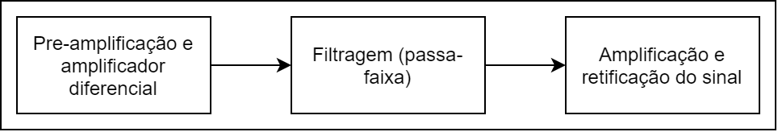
   <p align="center">Figura L. Diagrama do circuito</p>
</p>

### 2.1 Estágio diferencial
<!-- adicionar mais informações sobre esse circuito e o porquê de utilizá-lo -->
Na construção do circuito que fará a medição de biopotenciais é necessário atentar-se as questões de segurança dos pacientes,    

Para a construção deste estágio foi utilizada a configuração do amplificador de instrumentação, já que este tipo de amplificador diferencial permite:

- Alto ganho para entradas diferenciais é pequenas (mV): fator importante na obtenção das leituras em pacientes que estão em reabilitação, pois talvez tenham uma resposta elétrica muito baixa;
- Grande common mode rejection ratio (CMRR): aumenta a precisão ou ;
- Alta impedância de entrada, evitando o fluxo de altas correntes;

<!-- O GANHO NESSE ESTÁGIO DEVE SER DE 2.2 -->
<p align="center">
  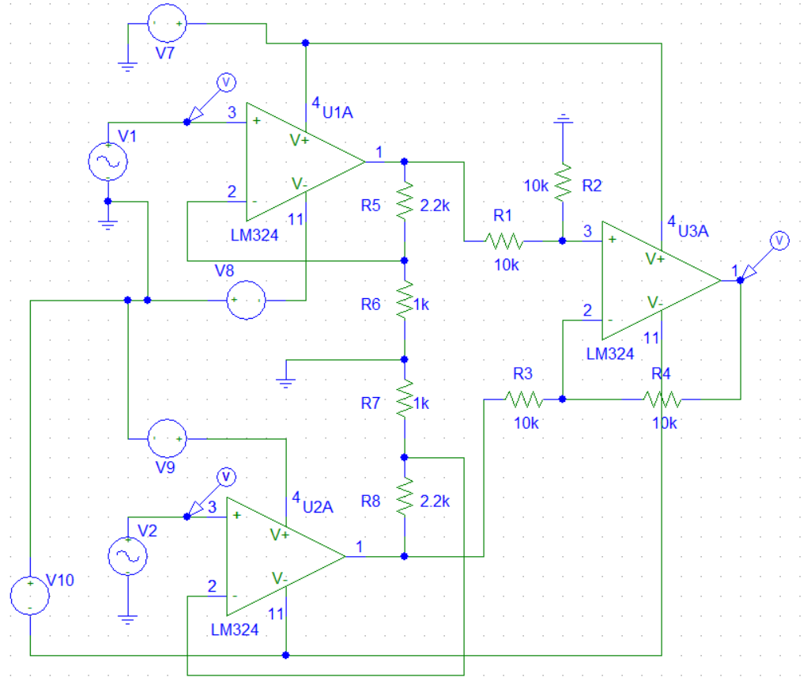
   <p align="center">Figura L. Estágio de pré-amplificação e diferencial</p>
</p>

**Simulação do circuito**

Para caracterizar os impulsos elétricos de entrada do circuito, utilizou-se um sinal senoidal com frequência de 100Hz e amplitude de 10mV e 5mV para V1 e V2 respectivamente, como é possível observar na figura seguinte.

<p align="center">
  
  <p align="center">Figura K. Entrada diferencial do circuito</p>
</p>

**Saída do estaǵio diferencial**

Na imagem abaixo observa-se o comportamento esperado, visto que a diferença entre V1 e V2 é de 5mV, e o ganho do estágio de pré-amplificação é de 101, resultando asim uma saída é levemente superior a 500mV. 
<!-- mudar esse ganho -->

<p align="center">
  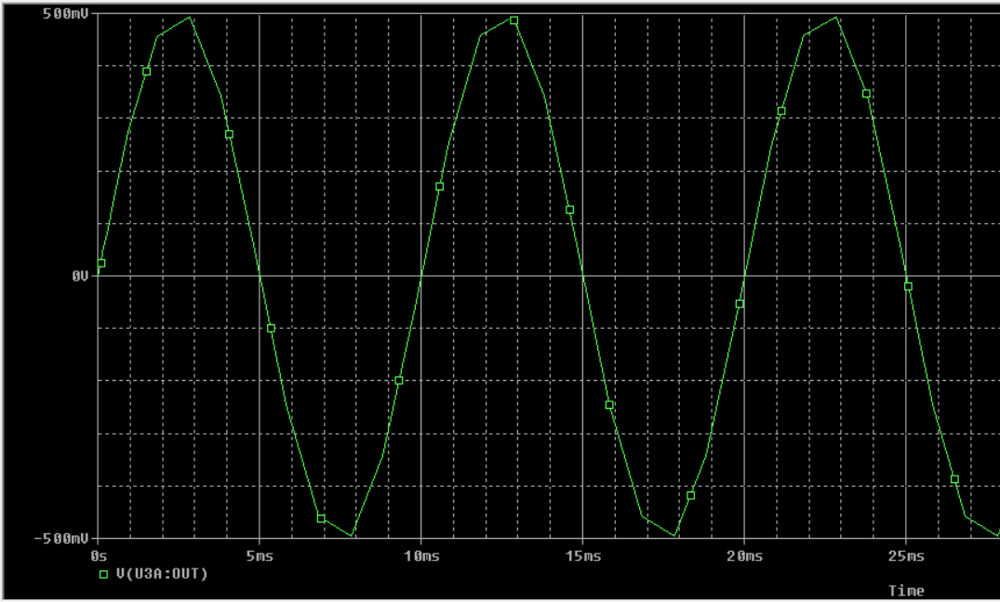
</p>

**Cálculo**

Como este módulo possui inicialmente um estágio de amplificação com a configuração não inversora, então o ganho deste estágio é representado pela seguinte equação:

```
Av = (R5/R6) + 1 
```
Então, tem-se que:
```
Av = (R5/R6) + 1
# Lembrando que R5 = R8 e R6 = R7
Av = (100k/1k) + 1
Av = 101 

# e Av(CM) = 1
```

Por fim, no estágio do amplificador diferencial, o ganho Av = -1, devido ao casamento de impedância dos resistores R1, R2, R3 e R4. Já o Av(CM) dependerá da precisão dos resistores:

```
Av(CM) = +-2 * (delta_R/R)
```


### 2.2 Estágio de filtragem

Para reduzir a presença de ruídos na aquisição do EMG, foi necessário realizar a construção de um módulo de filtragem. Como os sinais de EMG apresentam frequências entre 20 e 500Hz (Adicionar referências).

Como o objetivo é construir um filtro passa-faixa, dentre as possíveis configurações existentes optou-se por utilizar um passa-altas e passa-baixas em sequência. Isto é um fator facilitador quando a faixa de banda é específica, pois basta projetar a frequência de corte para cada estágio. 

<p align="center">
  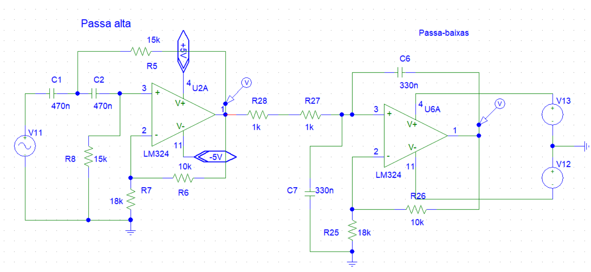
  <p align="center">Figura O. Filtro passa-faixa</p>
</p>
<!-- Descrever as características da tensão de entrada
  Mostrar os cálculos
  Colocar referências (OpenHardware)
  [ ] - Mostrar tensão de entrada
 -->

O primeiro estágio deste módulo é um filtro passa-altas Sallen-Key de componentes iguais ([Malvino](#referências), página 826). Essa configuração foi escolhida devido a simplificação na seleção dos valores de cada componente.

<p align="center">
  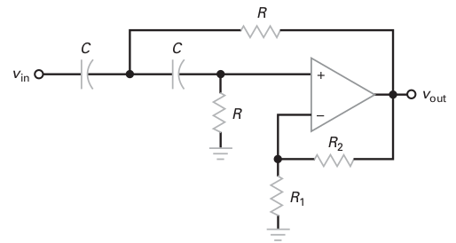
  <p align="center">Figura L. Filtro passa-altas Sallen-Key (Fonte: <a href="#referências">Malvino</a>, página 827)</p>
</p>

**Modelagem**

O filtro passa-altas precisa ter uma frequência de corte de 20Hz, então a escolha dos componentes partirão a partir da definição de algumas constantes:

* Q: Constante que define a aproximação da frequência de corte. 

* Fp: frequência de polo

* Fc: frequência de corte

* Av: ganho do circuito

* *k*<span style="font-size: 12px; font-style:italic">c</span>: constantes estabelecidas por simplificações realizadas por Butterworth, Bessel e Chebyshev com base na amplitude da ondulação de estágios de segunda ordem ([Malvino](#referências), página 815 vol. 2).

Tendo isto em vista, para facilitar os cálculos, dado que:

```
fc = fp/kc
```

* Deseja-se que *f*<span style="font-size: 12px; font-style:italic">c</span> = *f*<span style="font-size: 12px; font-style:italic">p</span>. Portanto, com base na tabela *k*<span style="font-size: 12px; font-style:italic">c</span> = 1. Entãp *f*<span style="font-size: 12px; font-style:italic">c</span> = *f*<span style="font-size: 12px; font-style:italic">p</span> = 20Hz.

A partir disto pode-se encontrar o resistor **R** e do capacitor **C** pela equação:

```
=> fp = 1/(2*pi*R*C)
=> 20 = 1/(2*pi*R*C)
=> RC = 1/(40*pi)
=> RC = 0.007957747
```

A partir deste momento o valor de R ou C deve ser arbitrário, então escolhendo R = 15k Ohms, tem-se que:

```
=> C = 0.007957747/15k
=> C = 531nF 
```

Então o capacitor será de 470nF, já que é o capacitor comercial mais próximo.
Por fim, para que a condição de *k*<span style="font-size: 12px; font-style:italic">c</span> = 1 seja satisfeita, a constante Q deve estar no intervalo: 0.577 < Q <= 0.707 . O valor de Q é obtido por:

```
Q = 1/(3 - Av)
# Av é obtido por:
Av = (R2/R1) + 1

# Logo: 
=> Av >= -1/0.707 + 3
=> Av = 1.58557

# Assim
R2/R1 = 0.58557
R2 = 0.58557*R1
```

Escolhendo R1 arbitrariamente igual a 18k Ohms, R2 = 10.5k Ohms, logo R2 = 10k Ohms.

**Passa-baixas**

Analogamente para o filtro passa-baixas aprensenta os mesmos passos:

<p align="center">
  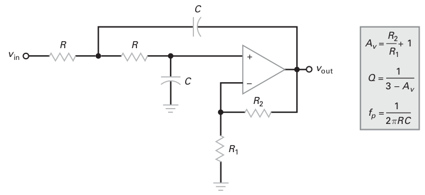
  <p align="center">Figura L. Filtro passa-baixas Sallen-Key (Fonte: <a href="#referências">Malvino</a>, página 822)</p>
</p>

**Simulação**

Na imagem abaixo é apresentado a saída do filtro passa-altas e passa-baixas caracterizados pela senoidal vermerlha e verde respectivamente. Certamente o sinal no final do estágio tem amplitude levemente maior devido ao ganho de 1.5 aproximadamente. Além disso o sinal não sofre deformações dentro da faixa de operação estabelecida.

<p align="center">
  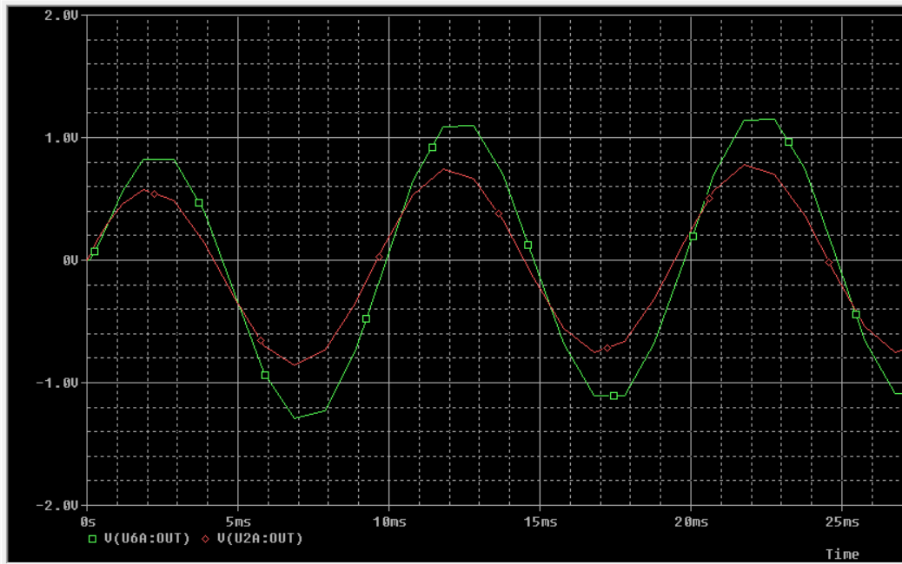
</p>


### 2.3 Estágio de amplificação e retificação

Neste estágio realiza-se a amplificação final do sinal juntamente com a retificação deste, visto que o sinal será convertido para um sinal digital. Além disso, este estágio permite ajuste do ganho, tendo então um valor entre 47 e 147 proximadamente concretizando um ganho máximo de 750 ou 57.2 db.

<p align="center">
  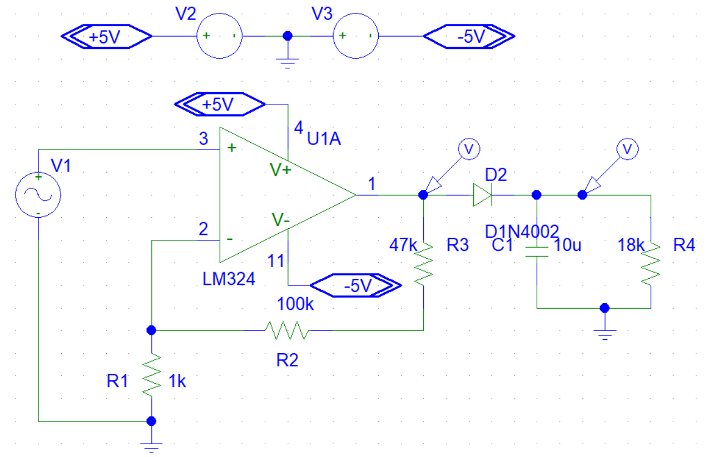
</p>

**Simulação**

<p align="center">
  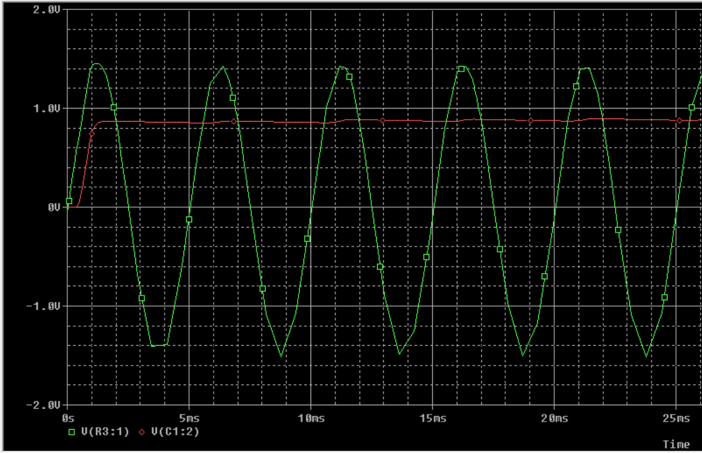
</p>

**Modelagem**

Para obter o ganho descrido anteriormente, basta ecolher arbitrariamente um dos resistores R1 ou R2. Lembrando que R2 = R2' + R3.

```
Av = R2/R1 + 1
```

Partindo de Av(total) = 750, porém com os estágios anteriores apresentam um total de 5.1, pois:

```
2.2 * ~1.5 * ~1.5 = 5.1

# então Av no último estágio deve ser de:
=> Av = 750/5.1
=> Av = 147
```

Por fim, calcula-se R2: 

```
=> R2 = (147-1)*1k
=> R2 = 146k Ohms
```
Por fim utilizando um potenciômetro de 100k Ohms e um resistor de 47k Ohms , é obtido um valor próximo ao desejado.

**Retificação**

## Interface gráfica 
<!-- Demonstrar o funcionamento da interface -->

Uma vez que a visualização gráfica é necessária para o profissional de saúde que fará o acompanhamento do paciente, foi desenvolvida uma interface gráfica que permite a visualização em tempo real da resposta muscular do paciente. Além disso, o usuário poderá fazer a exportação de um arquivo .CSV com os dados armazenados da consulta.

A interface recebe informações enviadas pelo arduino uno via comunicação serial. Para fins de simulação foi realizada a variação de tensão sob um potenciômetro de 10k Ohms, assim foi validado o funcionamento da interface.

A interface foi desenvolvida utilizando a ferramenta [Qt](https://www.qt.io/) e os motivos que levaram a escolha deste software estão descritas na seção de [Lista de Materiais](#Software). 

<p align="center">
  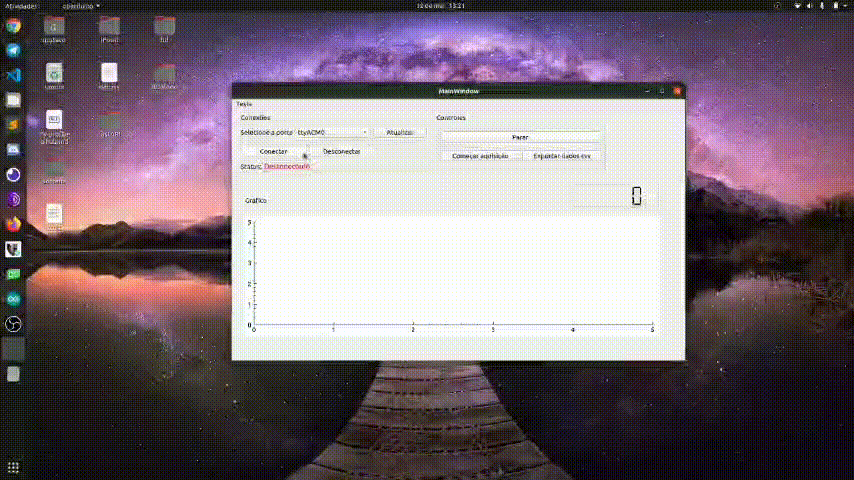
</p>

## Sistema de corrida
<!-- Descrição do controle do carro -->

Para esta primeira versão do sistema desenvolvido neste projeto, tem-se suporte para apenas 1 jogador, já que na especificação indica que o sistema deve possuir até 4 jogadores. Entretando, esta limitação pode ser removida com melhorias futuras. Outro ponto importante é que priorizou-se utilizar materiais de fácil acesso, de modo que fosse possível reaproveitar materiais recicláveis.

Foi utilizado um arduino uno para simular o controlador do sistema e um motor DC responsável por tracionar o carro de brinquedo. O [controle](./car_controller/car_controller.ino) desenvolvido para a ativação do motor é simples, a velocidade será proporcional a tensão lida pelo arduino. O arduino uno possui 10 bits de resolução, então os valores são convertidos entre 0 e 1023. Já a velocidade do motor DC é controlada por meio de um pulso PWM, cujo o duty cycle varia de 0 a 255, representando 0 a 100%.  

<p align="center">
  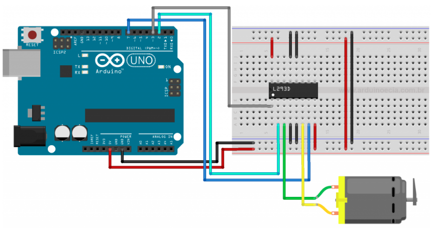
  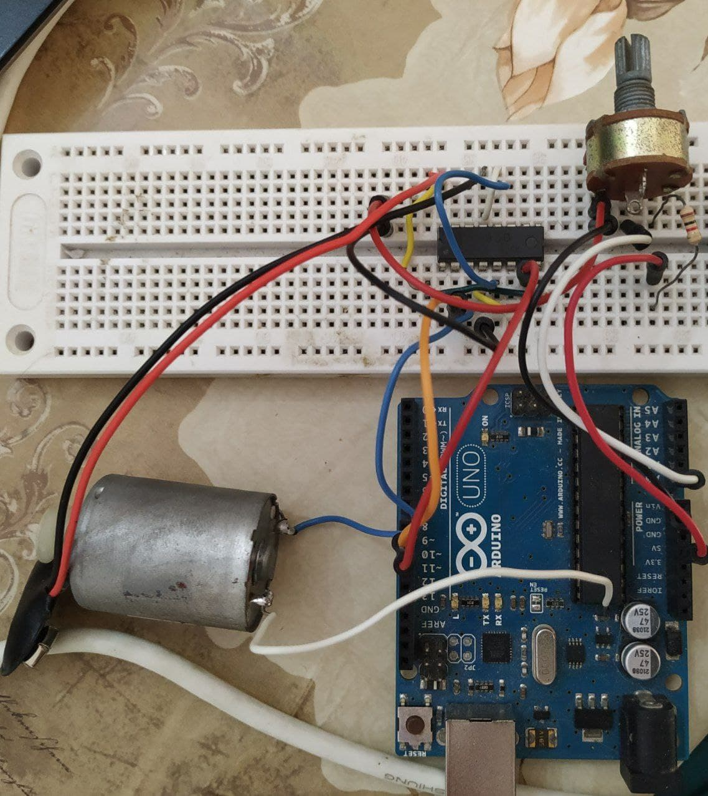
  <br>
  <p align="center">Figura A. Circuito para controle do motor: esquemático e testado (Fonte: <a href="https://www.arduinoecia.com.br/controle-de-motor-dc-com-o-l293d-ponte-h/">Arduino e Cia</a>).</p>
</p>
<br>

Já em relação ao ambiente/pista de corrida, optou-se por utilizar uma impressora, como pode-se observar na figura abaixo. A motivação da escolha parte da ideia de reciclagem, além disso a mecânica da estrutura permite a mesma dinâmica propocionada por jogos *drag racing*. Em paralelo ao motor tem-se um sensor ultra sônico para frenagem do carrinho quando este se aproximar na "linha de chegada".
Por fim o carro de brinquedo é anexado na superfície que é controlada pelo motor. 

<p align="center">
  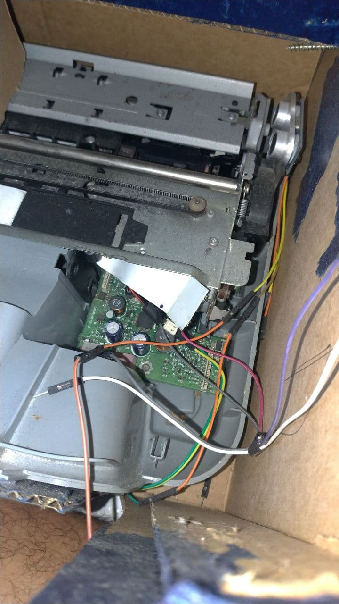
  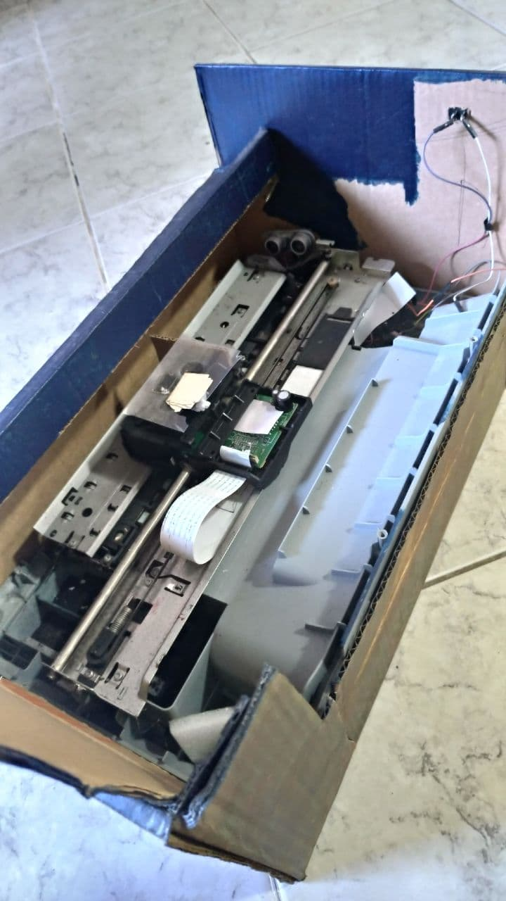
  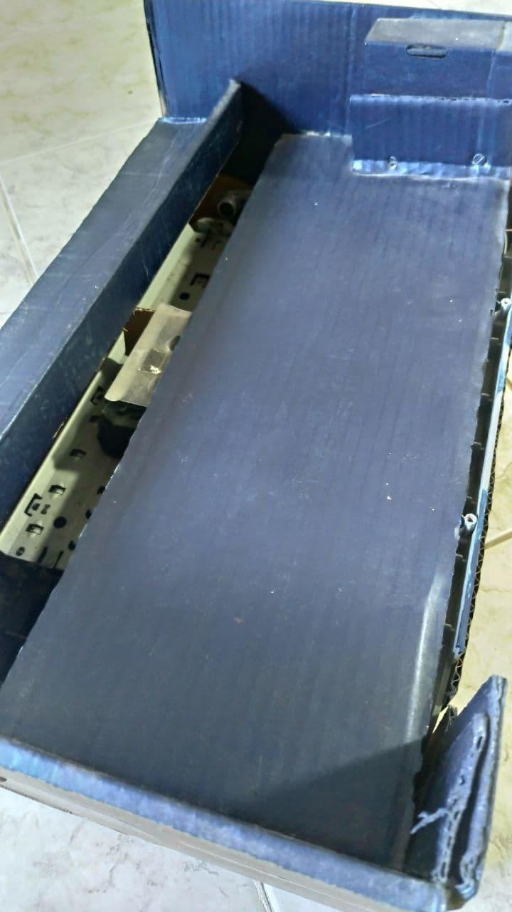
  <br>
  <p align="center">Figura X. Estrutura da pista</p>
</p>

É importante destacar que esta abordagem via corrida de carrinho é uma forma interessante de analisar o quadro de evolução do paciente. 

## Lista de Materiais e serviços

### Hardware

* Operacional [LM324](https://www.alldatasheet.com/datasheet-pdf/pdf/17871/PHILIPS/LM324.html) - uma unidade contém 4 operacionais;
* Resistores:
	* 1k - 2 unidades;
	* 5.6k - 1 unidade;
	* 9.1k - 1 unidade;
	* 33k - 1 unidade . 
* Potenciômetro de 100k - 1 unidade;
* Capacitor de 10nF - 1 unidade;
* Arduino nano - 1 unidade;
<!-- ou arduino nano, por ser mais prático -->
* **Eletrodo utilizado**:
<!-- Justificar a escolha do eletródo, usar como base o livro de instrumentação -->
* [Max1044/icl7660](https://datasheets.maximintegrated.com/en/ds/ICL7660-MAX1044.pdf): um conversor de tensão para -5V, este componente simplificará o circuito final para a alimentação simétrica dos estágios com amplificadores.

* Diodo [D1N4007]() : 
 <!-- razão de ter escolhido este diodo  -->

* [L293D](): é o módulo da ponte H, necessária para controle do motor DC.

* Bateria 9V: 


### Softwares
[voltar para índice](#índice) 

* [PSpice](https://www.electronics-lab.com/downloads/circutedesignsimulation/?page=5). Neste projeto foi utilizado este software de simulação por ser gratuito, utilizado em meio acadêmico, disponível para estudantes e devido a familiariadade do projetista com a ferramenta. Embora este software seja uma ótima ferramenta de simulação, a versão para estudante apresenta limitações na complexidade do circuito, então é importante destacar que **as simulações foram realizadas separadamente para cara bloco ou módulo do circuito proposto.**

* [IDE arduino](https://www.arduino.cc/en/software). Software amplamente utilizado para a programação e simulação de microcontroladores. A escolha desta ferramenta se dá devido ao microcontrolador utilizado, neste caso, um arduino uno e além disso devido a todo suporte existente da comunidade.

* [Qt](https://www.qt.io/download-open-source?hsCtaTracking=9f6a2170-a938-42df-a8e2-a9f0b1d6cdce%7C6cb0de4f-9bb5-4778-ab02-bfb62735f3e5). Este sofware foi utilizado para criação da interface gráfica. Por apresentar uma versão open source, ser gratúito, permitir funcionamento em multiplas plataformas e uso da linguagem C++, foram as razões consideradas para utilizar esta ferramenta neste projeto.


## Orçamento do projeto

Na lista abaixo contém todos os componentes utilizados e o respectivo preço. É importante que os itens da lista são vendidos no Brasil e, para fazer uma breve comparação, também é apresentado uma lista com o preço dos mesmos componentes disponíveis no mercado internacional. Deste modo dependendo da urgência/verba disponível para a construção do protótipo, pode-se escolher a melhor alternativa.

1. Max1044/icl7660 - R$ [49,90](https://produto.mercadolivre.com.br/MLB-1743219833-max1044icl7660-switched-capacitor-voltage-converters-5-pcs-_JM#position=5&type=item&tracking_id=fe80bb47-8e29-429a-8a61-f6f3be3a011d) (pelo mercado livre)

2. LM324 x 2

3. Resistores x *n* (quantidade de resistores)

4. Capacitores x *n* (quantidade de capacitores)

5. Impressão da placa

6. Arduino nano - RS [31,90](https://www.robocore.net/placa-arduino/placa-nano-v3-com-cabo-usb-para-arduino?gclid=Cj0KCQiAv6yCBhCLARIsABqJTjYw68xsy4khcI4-SAYwE8Emp7A2HrOhB0R6kJR8ZRxTo6YxT30KngkaAg1aEALw_wcB)

<p><strong>Total: </strong>R$ <span style="color: green">100,00 </span></p>


Optando por comprar no mercado internacional tem-se:


<p>Total: R$ <span style="color: green">100,00 </span></p>


## Referências 

[1](#) Ning, Z & Huang, J & Guo, S & Wang, L. (2020). A Portable Potentiostat for Three-Electrode Electrochemical Sensor. Journal of Physics: Conference Series. 1550. 042049. 10.1088/1742-6596/1550/4/042049.<br>

[2](#) Crespo, J. R. (2017). Electrochemical-SERS analysis of R6G using a microcontroller based Portable Potentiostat (Doctoral dissertation).<br>

[3](#) WEBSTER, H. E. J. G.Measurement, Instrumentation, and Sensors Handbook:Electromagnetic, Optical, Radiation, Chemical, and Biomedical Measurement. 2. ed.[S.l.]: CRC Press, 2014. 1921 p. ISBN 1439848912.<br>

[4](#) Malvino, Albert Paul; e Bates, David J.; Eletrônica, vol. 1 e vol. 2, 8a ed., Ed. McGraw Hill-Bookman, São Paulo, SP, 2016. Também em recurso eletrônico.


## Melhorias e ideias

